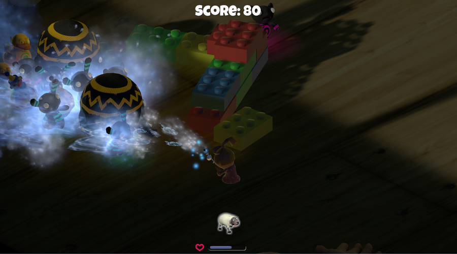

# game-zombie-toys

**Zombie Toys** is a **third-person endless survival arcade game** where the Player is a child (boy or girl) who has awoken to discover that all their toys have come to life and become zombified. Now the Player must survive by avoiding the zombie toy enemies.

They may accrue points by utilizing a special remote control toy to attack the zombies in one of four different ways (Lightning Ray, Freeze Ray, Stink Bomb, and Slime).

Using points accrued through the various attacks, the Player may also spawn Allies, which currently include a Sheep. The Allies will help the Player avoid the zombie toys and survive in the game.

**Online playable demo link:**

[http://caizicong.com/timecapsule/gamesdir/zombie_toys/index.html](http://caizicong.com/timecapsule/gamesdir/zombie_toys/index.html)

**PC runable package download:**

[http://blog-1252720346.cosgz.myqcloud.com/games/zombietoys/ZombieToys-by-ZicongCai.zip](http://blog-1252720346.cosgz.myqcloud.com/games/zombietoys/ZombieToys-by-ZicongCai.zip)

